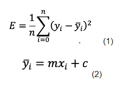

# Linear Regression in ARMv8
This project was made during in ECE 30 taught by Professor Mingu Kang for Spring 2021. 

## Project Description
We were tasked to write a program that implements a linear regression on a 2D list of points. The program used stochastic gradient descent (SGD) to learn a line that passes through the maximum number of points as possible. There were two major components in this project:
- training loop
- loss loop

All of the mathematical formulas were provided and all we needed was to convert pseudo-code into assembly code.

## Linear Regression
The two functions needed are the loss function and line of best fit. 

The image below shows the mathematical functions:

Linear regression is the process of finding a line that minimizes the distance between the line and every point in a dataset. It is essentially the line that best fits the list of points. The goal of this project is to essentially find the value for __m__ and __c__. To learn more about linear regression, click [here](https://towardsdatascience.com/linear-regression-using-gradient-descent-97a6c8700931?gi=d2ca64c54661).

## Implementation
There are five parts to the implementation of Linear Regression in ARMv8 Assembly. It follows a sequential order where the next part depends on the previous part.
- Loss Function
- Training Function
- Visualization
- Optimization using Epsilon
- Optimization using Threshold on Differences
- Normalization

For the sake of academic integrity, no code will be shown. If curious, please inquire me at kevshin2002@gmail.com. 

The implementation of the code shows that without an Epsilon and a Threshold gives:

__On Normalized Data__
- m = 0.68633878231
- c = 0.000001509984713266021572053432464599609375
- loss = 0.528939068317413330078125

__Raw Data__
- m = 0.68633878231
- c = 0.000001509984713266021572053432464599609375
- loss = 0.528939068317413330078125

With an Epsilon and a Threshold gives:

__On Normalized Data__
- m = 0.461439341307
- c = 4.55033897283 * 10^-37
- loss = 0.579518795013

__Raw Data__
- m = 0.461439341307
- c = 3.89417039059 * 10^-7
- loss = 0.579518795013

## Visualization
### Normalized Data without Epsilon and Threshhold = 1000 Iterations

## Unnormalized Data with Epsilon and Threshhold - 2 Iterations

## Necessity of Normalization
As we got NaN values when running the algorithm on the raw data, we needed to implement a normalization function. It stands to reason that the values in the file were too big to go through the algorithm without overflowing the 32 bits. 

As such, we added a line to the data file to have a float constant of -2. We used this value so that you can run both the unnormalized and normalized file on the same algorithm.

Condition = -2.0

